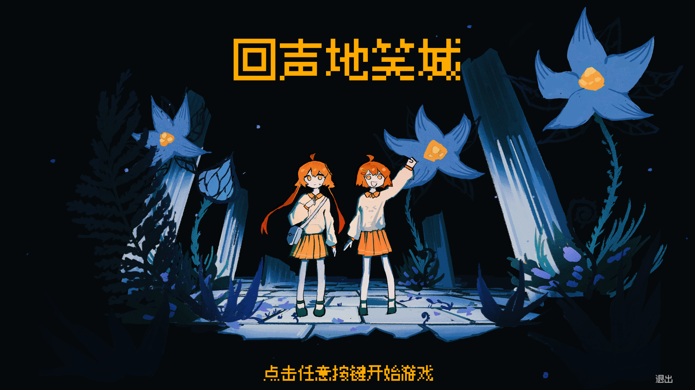
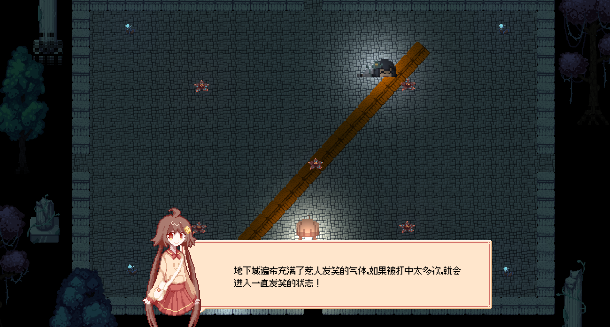
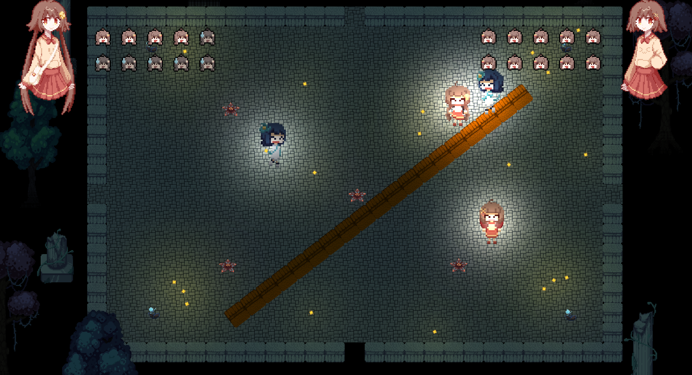
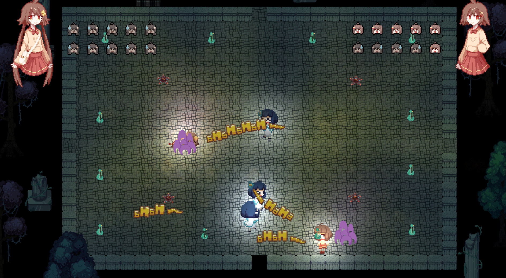

# Echo Dungeon

## Contributors

## Introduction

**Echo Dungeon** is a two-player local shooting game, a creation for the 2024 Global Game Jam. Players will take on the roles of two sisters who accidentally venture into the City of Laughter, where they must dodge attacks from laugh-inducing plants or laugh out loud to fend off enemies!

**Echo Dungeon**是一款双人本地射击游戏，玩家将扮演一对误闯地笑城的姐妹，躲避惹人发笑的植物袭击，或哈哈大笑击退敌人！这款游戏是2024 Global Game Jam的作品，本年主题为“Make me laugh”。

## Features and Technologies

### Advanced Technologies

- **URP Lighting**: Utilizes Unity's Universal Render Pipeline (URP) to achieve high-quality lighting effects, ensuring a visually appealing game environment.
- **Procedural Map Generation**: Implements algorithms for random map generation, providing a unique gameplay experience in each session.
- **Low-Coupling Event System**: Employs a low-coupling event system to manage in-game events efficiently, enhancing code maintainability and flexibility.
- **NavMesh Auto Navigation**: Uses Unity's NavMesh for automatic navigation, allowing enemies and NPCs to move intelligently within the game world.

---

Thank you for exploring Echo Dungeon. We hope you enjoy the game and the unique experience it offers!
